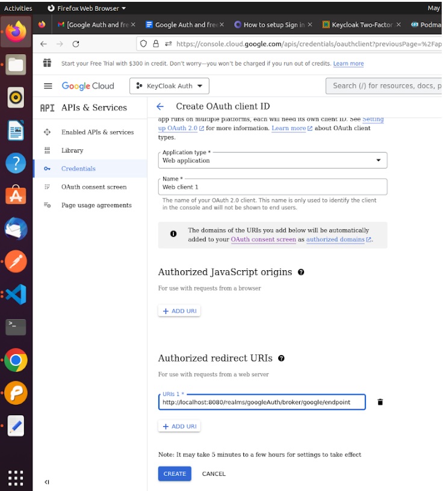

 <u> <h1 style="font-size: 50px;">Keycloak Setup</h1> </u> 

## 1. Task Requirement :  
- Integration of Google Auth with KeyCloak as an Identity Provider

-  Creating a login page in Vuejs which will authenticate with google using Keycloak and Keycloak FreeOTP service.

## 2. Environment details :
- Os:- Ubuntu 20.04.6 LTS

-  Podman- 3.4.2

-  Nodejs-v16.20.0

-  Npm-8.19.4 

## 3. Tools and technologies :
- Keycloak: 21.1.1
- Google Cloud Paltform
  https://console.cloud.google.com/apis/library
- Vuejs-  3.3.4

## 4 . Definition of tools :

**a . Ubuntu 20.04.6 LTS:** Ubuntu 20.04.6 LTS is a stable long-term support version of the Ubuntu Linux operating system.

**b . Podman 3.4.2:** Podman 3.4.2 is a containerization tool for managing and running containers on Linux systems.

**c . Node.js v16.20.0:** Node.js v16.20.0 is a JavaScript runtime for server-side applications.

**d . npm 8.19.4:** npm 8.19.4 is a JavaScript package manager for managing software dependencies.

**e . Google Auth And FreeOTP using KeyCloak And Vue**
One of the strong points in favour of Keycloak adoption is the fact that you can setup social signin for your application with a few clicks, no coding requirements needed. Keycloak supports out-of-the box an extensive list of social networks: Google, Github, Facebook, Linkedin, Microsoft, Twitter and many other providers. It’s even flexible enough to support the integration of any OpenId Connect or SAML 2.0 provider.

## Architecture Diagram

  

## 5 .  Command for the setup or configuration.

**a . Setup Keycloak using podman**  

**b . Podman**  

>Get started with Keycloak on Podman

**c . Before you start**
>Make sure you have Podman installed

**d . Start Keycloak**
From a terminal, enter the following command to start Keycloak 

    podman run -p 8080:8080 -e KEYCLOAK_ADMIN=admin -e KEYCLOAK_ADMIN_PASSWORD=admin quay.io/keycloak/keycloak:21.1.1 start-dev

- This command starts Keycloak exposed on the **local port 8080** and creates an initial admin user with the username **admin** and password **admin**.

- Next, log into Keycloak Administration Console, available at: http://localhost:8080
In your first Logi, you will be requested to create an administration user:

## 6 . Screenshot with pass test cases result,which you have already tested.

**a . Welcome to Keycloak :**

**b . Next, login with the admin user you have just created:**

**c . The Keycloak server**
Once you log in, Keycloak shows you the Master realm.

**d . Realm Definition**
A realm manages a set of users, credentials, roles, and groups. A user belongs to and logs into a realm. Realms are isolated from one another and can only manage and authenticate the users that they control.

**e . Create Realm for google Authentication**

**Procedure**

*  Point to the top of the left pane.  

* Click Create Realm.

* Add realm menu 
    file:///tmp/mume2023717-2620-1ac73x.ewp7q.html
  

* Enter a name for the realm
* Click Create.

**f . Create realm** 

The current realm is now set to the realm you just created. You can switch between realms by clicking the realm name in the menu.

**g . Configuring SSL for a realm**

Each realm has an associated SSL Mode, which defines the SSL/HTTPS requirements for interacting with the realm. Browsers and applications that interact with the realm honor the SSL/HTTPS requirements defined by the SSL Mode or they cannot interact with the server.   

**Procedure** 

* Click **Realm settings** in the menu.

* Click the **General** tab.

**General tab**

**1 . Set **Require SSL** to one of the following SSL modes: **example****

* **<u>External requests</u>** Users can interact with Keycloak without SSL so long as they stick to private IP addresses such as localhost, 127.0.0.1, 10.x.x.x, 192.168.x.x, and 172.16.x.x. If you try to access Keycloak without SSL from a non-private IP address, you will get an error.

* **<u>None</u>** Keycloak does not require SSL. This choice applies only in development when you are experimenting and do not plan to support this deployment.

* **<u>All requests</u>** Keycloak requires SSL for all IP addresses.

**2 . Add Identity Provider from the list Choose Google**

**3. Copy Redirect URI to be used for google configuration.**

**4 . Setup  Google configuration for Authentication**

*  Login with your gmail account  the link https://console.cloud.google.com/ 

* In the Google Cloud console, go to Menu > click on API and Services option.

 

* Click on the Select a **create a Project** at the top left  and create a new project. 

* In the **Project Name** field, enter a descriptive name for your project. 

**5 .  Click on the Oauth consent screen and configure it.**

**6 . Setting up the credentials to get clientID and client secret**  

**Click on the Credentials -> Create Credentials-> OAuth Client ID-> Application Type->
Web Application**

 

**7 . Paste the redirect url which we copied from keycloak in the Authorized Redirect URL field.**

**8 . Click on Create then you will get client ID and client Secret. Copy both to be used in keycloak configuaration.**  

**9 . Paste the ClientID and Client secret in google identity provider configuration.**

**10 . Create a Client in Keycloak and configure the Access Setting.**

**Note- Input your Vue URL in the Valid Redirect URI fields, and set Web Origin to**

**11.  Now we have to setup the flow.**  

**for authentication and post authentication of Identity provider.**

**Your Realm-> Authentication-> first broker login->Click on the 3 dots ->Choose Duplicate->Named the Duplicate Copy to any.**  

**12 . Click on first broker login match the flow as shown below**

**13 . Click on the Copy of the first broker link. Remove all the steps and add OTP Form Steps
As shown below**

**14 . Setup the Flows in google identity provider configuration.**

**Click on Identity Provider->google->Advance Setting->First Login Flow-> Choose first borken login-> Post login flow-> Choose Copy of first broken login -> Save**

**15 . Setting up the  FreeOTP Configuration in keycloak.**

**Click on Authentication-> Required Action-> Configure OTP -> Enable → ON  and Set as default Action→ ON.**   

**Verify the OTP Policy is same as shown below.**

**h . Authenticate with Vue and Vite**

**user@user-pc:~$ node --version
v16.19.1**

**1 . > npm init vue@latest**

    > ✔ Project name: … <your-project-name>
    ✔ Add TypeScript? … No / Yes
    ✔ Add JSX Support? … No / Yes
    ✔ Add Vue Router for Single Page Application development? … No / Yes
    ✔ Add Pinia for state management? … No / Yes
    ✔ Add Vitest for Unit testing? … No / Yes
    ✔ Add Cypress for both Unit and End-to-End testing? … No / Yes
    ✔ Add ESLint for code quality? … No / Yes
      ✔ Add Prettier for code formatting? … No / Yes

    Scaffolding project in ./<your-project-name>...
    Done.   
  >  cd <your-project-name>  

  > npm install  

  > npm run dev

**2 . Install keycloak adapter in Vuejs.** 

  > npm install keycloak-js@12.0.4

**3 . Create js file in vue for keycloak configuration
and paste the code shown below.**

**auth.js**

    import Keycloak from 'keycloak-js';
    const keycloak = new Keycloak({
      url: 'http://localhost:8080',
    realm: 'googleAuth',
      clientId: 'app-vue',
      });
    export default keycloak

**4 . Create Login Page in vue**

**Login Page.Vue**

    <template>
    

    

    

    <h1 style="margin-top:40px;">Keen</h1>
       <h1 style="margin-left: 170px; margin-top:1px;">Able</h1>
    
     
Always Been Open!

    
    

     

    

    <h5>Login</h5>
    

     <button  @click="login"><i class="fa-brands fa-google" aria-hidden="true"></i> LogIn with Google</button>
    
   
    

    

    </template>
    

**5 . Create Home Page after successful login to redirect.**

**HomePage.vue**

    <template>
    

    <h1>
     Welcome
     

     {{ usermail }}
    </h1>
    <button type="button" class="btn btn-primary" @click="logOut">
     LogOut
     </button>
     

    </template>
    

-  Running the application and Authenticate with Google and FreeOTP

  > npm run dev

- Install FreeOTP app from play store and scan it for first time. Input 6 digit Code

- Successfully Logged In...

## 7. TEST CASES LIST ##
| S.NO | Component/Tool Name | Test case | Test count | Test cases | Expected Result | Test Passed[PASS/FAIL] | Remarks |
|----------|----------|----------|----------|----------|----------|----------|----------|

Note :NA

## Screen with pass test cases result ##

Note :NA

## 8. REFERENCE LINK
https://keycloakthemes.com/blog/how-to-setup-sign-in-with-google-using-keycloak
https://www.keycloak.org/docs/latest/securing_apps/#_javascript_adapter
